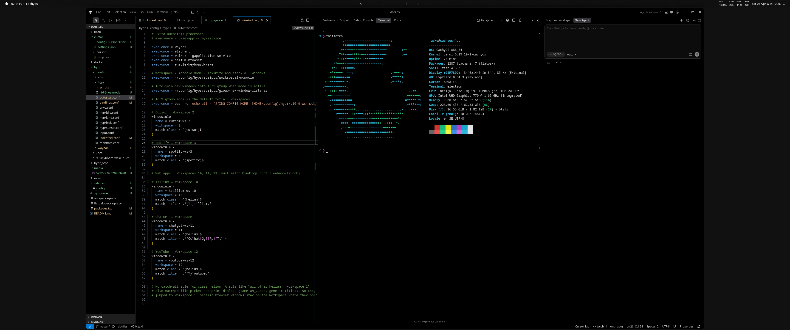
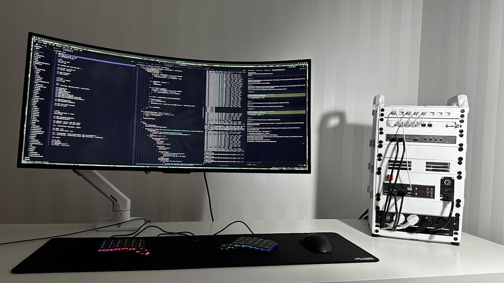

# dotfiles

Personal configs for **CachyOS** (Arch-based).

**Desktop:** Hyprland, Waybar, UWSM, Walker + Elephant, Helium Browser, AGS (volume/media/power popups). Optional **hypr_htpc** profile for HTPC.

**Shell & prompt:** Fish, Starship.

**Editors & coding:** Lazyvim, Cursor, t3code, Ghostty.

**Network / infra:** Docker, Netbird.